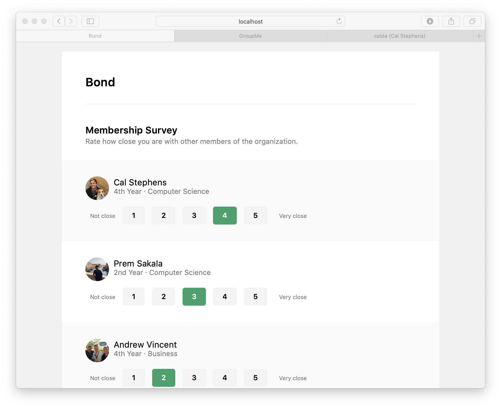
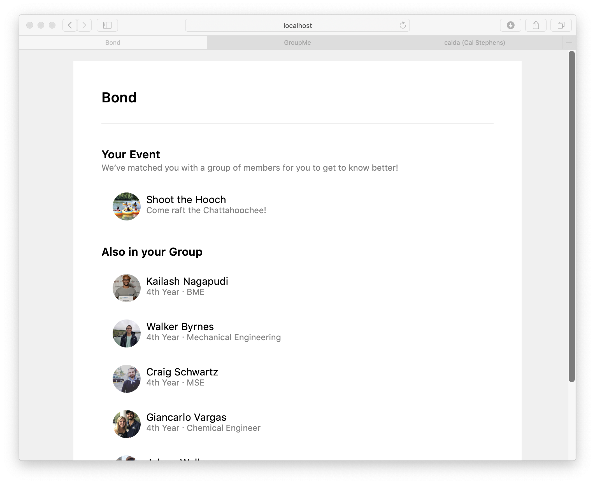

## Bond

Fostering a sustainable, cohesive culture in your Greek organization by building stronger bonds among your members.

Members of your organization rate how close they are with either, and their interest in various events. They're matched with members to get to know beter based on shared interests.

